# BIM Execution Plan

## Goal
The tool should create a structural analysis report. That will be achieved by retrieve an IFC file from e.g. the architect and upload that to the tool. 
## Model Uses
### What does the setup?
#### Create CSV file with coordinates
#### Add material properties
#### Add different loads
#### Strucutral analysis
### Who will use it
