# Report
## 3A: Analyse use case
### 1. Goal
Add material properties, e.g. the density, compressive strength, and yield strength to each element in the IFC model to calculate e.g. weight and dead load for each element.
### 2. Model Use (BIM use)
#### What does the setup?
The setup can be divided into four parts, the creation of an IFC file with all coordinates of beams and columns, adding material properties to the model, adding different loads, and creating a structural report for the model. 
##### 1. Create a CSV file with the coordinates
The first part is a tool without the user's interaction. The user has to upload the IFC file to the tool and the tool starts to generate the coordinates for each element. 
The script looks then for load-bearing elements like beams and columns. In the case that the model contains no structural elements, the user gets a notification that the tool could not find any load-bearing elements and the user has to upload a new file. If there are load-bearing elements the tool extracts the start and end points of each element and writes it to a list for beams and columns. The start and end points get the script from the vertices through ifcopenshell. Once the tool has the vertices in a matrix, it looks for the direction by looking for the first and second (in the case of a sloped beam/column) biggest distance and assigns a plane to the element. The plane is important to calculate the correct direction vector that is multiplied by the rotation matrix to get the absolute coordinate of the element. By adding or subtracting the half of the length we get the start and end point for the element. Afterward, the script extracts the cross-section and material for each element and stores it in a list in the tool. This information is also saved in the created lists. 
At the end of this part, the tool creates a new IFC file with the coordinates of each element and connects the nodes with lines that refer to the original element tag. This created IFC file can also now be used for other programs like a FEM software or the user continues the script and add material properties to the model which is described in the next section. 
##### 2. Add material properties
The purpose of this part of the tool is to enrich the IFC model with material properties that have not been defined yet, for example, material density, material compressive strength, etc. The script goes through all elements in the model and looks for the different materials. Afterward, a CSV file is created with all materials that are defined in the model. The user's task is now to add manually specific material properties like density, compressive strength, yield strength, and ultimate strength. The script will read the CSV file and will add the material properties from the CSV file and it will save the enriched model as a new IFC file called "updated_model.ifc". It is important to add the properties with Excel, otherwise, you will get an error that the file is in use and can not be saved.
##### 3. Add different loads
The user can update data for external loads like wind, seismic, a snow loads and upload the support conditions for the model. The IFC model is now fully prepared to perform a structural analysis in the next part.
##### 4. Structural analysis
Considering all the previous steps, all the data should be gathered to perform a structural analysis. Finally, a structural report can be created. Based on this final report, different modifications can be carried out to improve the structural design. Then, the tool starts again with these potential improvements. The report includes of each element the stresses and strains as the internal forces to determine the necessary cross-section and displacements.
#### Who will use it
The tool can be used by architects to see if the designed structure can be built or get a first idea of displacements and strengthen elements if displacements are too huge, e.g. a steel frame that contains glass. However, the main user should be an engineer to perform a structural analysis in less time. 
### Process
Before using the tool it is important that the person who gives you the IFC file exported an IFC4 file. Otherwise, the code is not able to run because the commands in ifcopenshell are different for IFC2x3 and IFC4. 
The person who uses the tool afterward should check if the code works also for their project. The code we wrote is especially for beams and columns and also works for that.
However, the setup is not tested for slabs, foundations, or other structural elements.
The information is written into a report that can be used to get a permit from authorities or as a readable version for persons that do not rely on the topic, e.g. various customers.
The process can be iterative. In the beginning, there must be load-bearing elements before the tool starts. In the end, before the report is created, the user has to prove, that the results are acceptable.
### Information Exchange
The minimum level of detail for our workflow to work is LOD 300, in which specific elements are confirmed as 3D object geometry with object dimensions, capacities, and connections defined. In this way, the start and end coordinates for each element can be obtained. After the workflow, the LOD will still be 300, but some additional material properties will be available for the next stages.
The detailed specification of the information exchange requirements can be found in the attached [Excel-file](./ExchangeInformation.xlsx)

For more information please read the [BIM Execution Plan](./BEP.md)
## 3B: Propose a (design for a) tool / workflow
### 1. Process: 

The BPMN diagram shows the entire design for a BIM use case, the assignment 3 includes only the red box which is described in the following section.
### 2. Description:
The purpose of this use case is to add material properties to the IFC file that are not existing before. The script goes through all elements in the model and looks for the material. In the end the script creates a CSV file with all materials that are used in the model. The user's task is now to add manually specific material properties like density, compressive strength, and yield strength and save the file. 
Now, the user must go back to the command line in his coding environment and continue the script by pressing Y and confirm with Enter. 
The script will read the CSV file and go through each element and add the material properties from the CSV file and will save the enriched model as a new IFC file called "updated_model.ifc".
## 3C [removed for this assignment]
## 3D: Value: What is the potential improvement offered by this tool?
The tool will save a huge amout of time of an employer. In the past the material properties have to be added by hand for each element in BlenderBIM. With this tool it just needs a couple of seconds to add several properties to all elements in the model.
The tool will not make the world directly to a better place in terms of peace, but it will save time by speeding up the planning process and save a lot of money.
